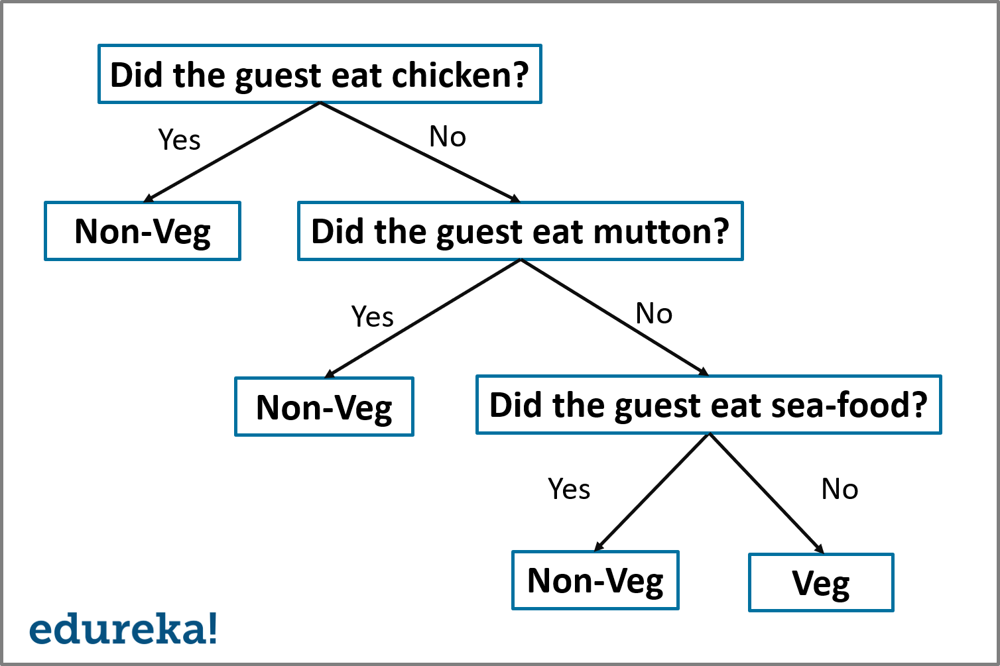
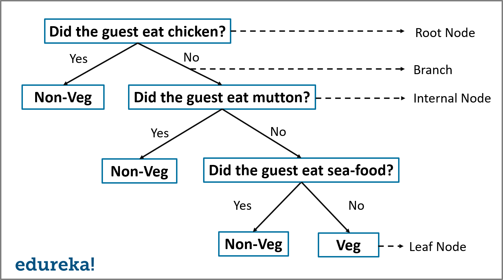
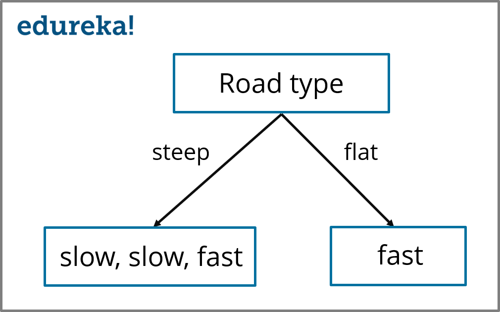
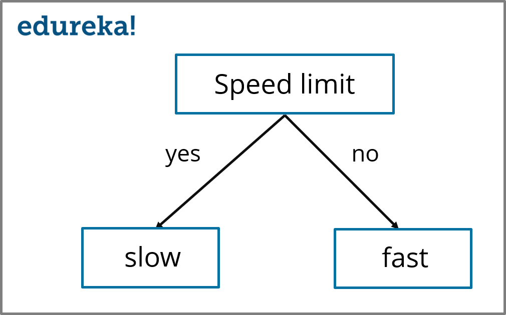

```{r include=FALSE}
library(data.table)
```

```{r}
## Data file was pulled from Kaggle classification website: https://www.kaggle.com/uciml/mushroom-classification
DATA_FILE_PATH <- '../data/mushrooms.csv'
```


## Reference

This guide comes from this [website](https://www.edureka.co/blog/decision-tree-algorithm/).

## Introduction

The decision tree algorithm is an algorithm that can be used to solve Regression and Classification type problems.

## Contents

1. [Why Decision Tree]
2. [What is a Decision Tree]
3. [How does the Decision Tree Algorithm work]
4. [Building a Decision Tree]
5. [Practical Implementation of Decision Tree Algorithm using R]

## Why Decision Tree

Decision Tree is considered to be one of the most useful Machine Learning algorithms since it can be used to solve a variety of problems. Here are a few reasons why you should use Decision Tree:

* It is considered the most understandable Machine Learning algorithm - easily interpretable.
* It can be used for both regression and classification.
* Unlike most Machine Learning algorithms, it works effectively with non-linear data.
* Constructing a Decision Tree is a very quick process since it only uses one feature per node to split the data.

## What is a Decision Tree

```{}
A Decision Tree is a Supervised Machine Learning algorithm which looks like an inverted tree, wherein each node represents a predictor variable (feature), the link between nodes represent a Decision and each leaf node represents an outcome (response variable).
```

To get a better understanding of a Decision Tree, let's look at an example:

Let's say that you hosted a huge party and you want to know how many of your guests were non-vegetarians. To solve this problem, let's create a simple Decision Tree.



In the above illustration, I've created a Decision Tree that classifies a guest as either vegetarian or non-vegetarian. Each node represents a predictor variable that will help to conclude whether or not a guest is a non-vegetarian. As you traverse down the tree, you must make decisions at each node, until you reach a dead-end.

Now that you know the logic of a Decision Tree, let's define a set of terms related to a Decision Tree.



A Decision Tree has the following structure: 

* **Root Node:** The root node is the starting point of a tree. At this point, the first split is performed.
* **Internal Nodes:** Each internal node represents a decision point (predictor variable) that eventually leads to the prediction of the outcome.
* **Leaf/Terminal Node:** Leaf nodes represent the final class of the outcome and therefore they're called the terminal nodes.
* **Branches:** Branches are connections between nodes, they're represented as arrows. Each branch represents a response such as *yes* or *no*.

Now, let's try to understand the workflow of a Decision Tree...

## How does the Decision Tree Algorithm work

The Decision Tree Algorithm follows the below steps:

**Step 1:** Select the feature (predictor variable) that best classifies the data into the desired classes and assign that feature to the root node.

**Step 2:** Traverse down from the root node, whilst making relevant decisions at each internal node such that each internal node best classifies the data.

**Step 3:** Route back to step 1 and repeat until you assign a class to the input data.

The above-mentioned steps represent the general workflow of a Decision Tree used for classification purposes.

## Building a Decision Tree

### Building a Decision Tree using ID3 Algorithm

There are many ways to construct a Decision Tree, in this demo we will focus on using the ID3 Algorithm.

#### What is the ID3 Algorithm

ID3 or the Iterative Dichotomizer 3 algorithm is one of the most effective algorithms used to build a Decision Tree. It uses the concept of *Entropy* and *Information Gain* to generate a Decision Tree for a given data set.

**The ID3 Algorithm:**

The ID3 Algorithm follows the below workflow in order to build a Decision Tree:

1. Select **Best Attribute** (A).
2. Assign A as a decision variable for the root node.
3. For each value of A, build a descendent of the node.
4. Assign classification labels to the leaf node.
5. If data is correctly classified: Stop.
6. Else: Iterate over the tree.

The first step says that we need to select the best attribute, but what does that mean?

*The best attribute (predictor variable) is the one that separates the data set into different classes most effectively or it is the feature that best splits the data set.*

Now the next question in your head must be, *"How do I decide which variable/feature best splits the data the data?"*

Two measures are used to decide the best attribute:

1. Information Gain
2. Entropy

**What is Entropy?**

```{}
Entropy measures the impurity or uncertainty in the data. It is used to decide how a Decision Tree cqn split the data.
```

**Equation for Entropy:**

$Entropy = -\Sigma p(x)log p(x)$

**What is Information Gain?**

```{}
Information Gain (IG) is the most significant measure used to build a Decision Tree. It indicates how much "information" a particular feature/variable gives us about the final outcome. 
```

Information gain is most important because it is used to choose the variable that best splits the data at each node of a Decision Tree. The variable with the highest IG is used to split the data at the root node. 

**Equation for Information Gain (IG):**

$Information Gain = entropy(parent) - [weighted average] * entropy(children)$

To better understand how Information Gain and Entropy are used to create a Decision Tree, let's look at an example. The below data set represents the speed of a car based on certain parameters.

```{r}
data.table(
  `Road Type` = c('steep', 'steep', 'flat', 'steep'),
  Obstruction = c('yes', 'no', 'yes', 'no'),
  `Speed Limit` = c('yes', 'yes', 'no', 'no'),
  Speed = c('slow', 'slow', 'fast', 'fast')
)
```

Your problem statement is to study this data set and create a Decision Tree that classifies the speed of a car (response variable) as either slow or fast, depending on the following predictor variables:

* Road Type
* Obstruction
* Speed limit

We'll be building a Decision Tree using these variables in order to predict the speed of a car. Like I mentioned earlier, we must first begin by deciding on a variable that best splits the data set and assign that particular variable to the root node and repeat the same thing for the other nodes as well.

At this point, you may be wondering how do you know which variable best separates the data? The answer is the variable with the highest Information Gain best divides the data into the desired output classes.

So, let's begin by calculating the Entropy and Information Gain for each of the predictor variables, starting with `Road Type`.

In our data set, there are four observations in the `Road Type` column that corresponds to four labels in the `Speed of car` column. We shall begin by calculating the Entropy of the parent node (Speed of car column). 

Step 1 is to find out the fraction of the two classes present in the parent node. We know that there are a total of four values present in the parent node, out of which two samples belong to the `slow` class and the other 2 belong to the `fast` class, therefore:

* P(slow) -> fraction of `slow` outcomes in the parent node
* P(fast) -> fraction of `fast` outcomes in the parent node

The formula to calculate P(slow) is: 

*P(slow) = no. of `slow` outcomes in the parent node / total number of outcomes

$P_{slow} = \frac{2}{4} = 0.5$

Similarly, the formula to calculate P(fast) is:

*P(fast) = no. of `fast` outcomes in the parent node / total number of outcomes

$P_{fast} = \frac{2}{4} = 0.5$

Therefore, the Entropy of the parent node is:

$Entropy_{parent} = -\Sigma P_{slow} log_2(P_{slow}) + P_{fast} log_2(P_{fast})$

*Entropy(parent) = -{ 0.5 log2(0.5) + 0.5 log2(0.5) } = -{ -0.5 + (-0.5) } = 1.0*

Now that we know that the Entropy for the parent node is 1, let's see how to calculate the Information Gain for the `Road Type` variable. Remember that, if the Information Gain for the `Road Type` variable is greater than the Information Gain for all other predictor variables, only then can the root node be split by using the `Road Type` variable.

In order to calculate the Information Gain of the `Road Type` variable, we first need to split the root node by the `Road Type` variable.



In the above illustration, we've split the root node by the `Road Type` predictor variable, the child nodes denote the corresponding response as shown in the data set. Now, we need to measure the Entropy of the child nodes.

The Entropy of the right-hand side child node (fast) is 0 because all the outcomes in the node belong to one class (fast). In a similar manner, we must find the Entropy of the left-hand side node (slow, slow, fast).

In this node, there are two types of outcomes (fast and slow), therefore, we first need to calculate the fraction of slow and fast outcomes for this particular node:

*P(slow) = 2/3 = 0.667*
*P(fast) = 1/3 = 0.334*

Therefore, the Entropy is:

*Entropy(left child node) = -{ 0.667 log2(0.667) + 0.334 log2(0.334) } = -{ -0.38 + (-0.52) } = 0.9*

Our next step is to calculate the Entropy(Children) with weighted average:

* Total number of outcome in parent node: 4
* Total number of outcomes in left node: 3
* Total number of outcomes in right node: 1

Formula for Entropy(Children) with weighted average: 

```{}
[Weighted Average]Entropy(Children) = (no. of outcomes in left child node) / (total no. of outcomes in parent node) * (entropy of left node) + (no. of outcomes in right child node) / (total no. of outcomes in parent node) * (entropy of right node)
```

By using the above formula you'll find that the Entropy(Children) with weighted average is 0.675.

Our final step is to substitute the above weighted average in the IG formula in order to calculate the final IG of the `Road Type` variable:

$Information Gain = Entropy(parent) - [weighted average] * Entropy(children)$

Therefore, 

*Information Gain (Road Type) = 1.0 - 0.675 = 0.325*

*Information Gain of Road Type is 0.325*

As was mentioned above, the Decision Tree Algorithm selects the variable with the highest Information Gain to split the Decision Tree. Therefore, by using the above method you need to calculate the Information Gain for all predictor variables to check which variable has the highest IG.

So by using the above methodology, you must get the following values for each predictor variable:

1. Information Gain (Road Type) = 1.0 - 0.675 = 0.325
2. Information Gain (Obstruction) = 1.0 - 1.0 = 0.0
3. Information Gain (Speed limit) = 1.0 - 0 - 1.0

So, here we see that the `Speed limit` variable has the highest Information Gain. Therefore, the final Decision Tree for this dataset is built using the `Speed limit` variable.



Now that you know how a Decision Tree is created, let's run a short demo that solves a real-world problem by implementing Decision Trees.

## Practical Implementation of Decision Tree Algorithm using R

**Problem Statement:** To study a Mushroom data set in order to predict whether a given mushroom is edible or poisonous to human beings.

**Data Set Description:** The given data set contains a total of 8124 observations of different kind of mushrooms and their properties such as odor, habitat, population, etc. A more in-depth structure of the data set is shown in the demo below.

**Logic:** To build a Decision Tree model in order to classify mushroom samples as either poisonous or edible by studying their properties such as odor, root, habitat, etc.

Now that you know the objective of this demo, let’s get our brains working and start coding. For this demo, I’ll be using the R language in order to build the model.

### Step 1: Load the libraries

```{r load dependencies, message=FALSE, warning=FALSE}
library(rpart,quietly = TRUE)
library(caret,quietly = TRUE)
library(rpart.plot,quietly = TRUE)
library(rattle)
```

### Step 2: Import the data set

```{r}
mushrooms <- read.csv(DATA_FILE_PATH)
```

Now, to display the structure of the data set, you can make use of the R function `str()`.

```{r}
str(mushrooms)
```

The output shows a number of predictor variables that are used to predict the output class of a mushroom (poisonous or edible).

### Step 3: Data Cleaning

```{r number of rows with missing values}
nrow(mushrooms) - sum(complete.cases(mushrooms))
```

```{r deleting redundant variable `veil.type`}
mushrooms$veil.type <- NULL
```

### Step 4: Data Exploration and Analysis

To get a good understanding of the 21 predictor variables, let's create a table for each of predictor variable vs class type (response / outcome variable) in order to whether that particular variable is significant for detecting output or not.

```{r analyzing the odor variable}
table(mushrooms$class, mushrooms$odor)
```

In this snippet, `e` stands for edible and `p` stands for poisonous. We can see that `c`, `f`, `m`, `p`, `s` and `y` are clearly poisonous. In addition, we can see that mushrooms with an almond (`a`) flavor are edible. Such observations will help us to predict the output class more accurately.

Our next step in the data exploration stage is to predict which variable would be the best one for splitting the Decision Tree. For this reason, I've plotted a graph that represents the split for each of the 21 variables, the output is shown below:

```{r}
number.perfect.splits <- apply(X = mushrooms[-1], MARGIN = 2, FUN = function(col) {
  mush_t <- table(mushrooms$class, col)
  sum(mush_t == 0)
})

## Descending order of perfect splits
mush_order <- order(number.perfect.splits, decreasing = TRUE)
number.perfect.splits <- number.perfect.splits[mush_order]

## Plot Graph
par(mar = c(10, 2, 2, 2))
barplot(number.perfect.splits,
        main = 'Number of perfect splits vs feature',
        xlab = '',
        ylab = 'Feature',
        las = 2,
        col = 'wheat')
```

The output shows that the `odor` variable plays a significant role in predicting the output class of the mushroom.

### Step 5: Data Splicing

Data splicing is the process of splitting the data into a train set and a test set. The train set is use to build the Decision Tree model and the testing set is used to validate the efficiency of the model.

```{r}
## Data splicing
set.seed(12345)
idx_train <- sample(1:nrow(mushrooms), size = ceiling(0.80 * nrow(mushrooms)), replace = FALSE)

## Training set
mushroom_train <- mushrooms[idx_train,]
## Test set
mushroom_test <- mushrooms[-idx_train,]
```

To make the demo more interesting and to minimize the number of poisonous mushrooms misclassified as edible we will assign a penalty of 10X bigger, than the penalty for classifying an edible mushroom as poisonous because of obvious reasons.

```{r}
prop.table(table(mushroom_train$class)) * 100
```

```{r}
prop.table(table(mushroom_test$class)) * 100
```

To make the demo more interesting and to minimize the number of poisonous mushrooms misclassified as edible, let's assign a penalty of 10X bigger larger than the penalty for classifying an edible mushroom as poisonous.

```{r create a penalty matrix}
penalty.matrix <- matrix(c(0, 1, 10, 0), byrow = TRUE, nrow = 2)
```

### Step 6: Building the model

In this stage, we're going to build the Decision Tree by using `rpart` (Recursive Partitioning And Regression Trees) algorithm:

```{r building the classification tree with rpart}
tree <- rpart(class~.,
              data = mushroom_train,
              parms = list(loss = penalty.matrix),
              method = 'class')
```

### Step 7: Visualizing the tree

In this step, we're going to use the `rpart.plot` library to plot our final Decision Tree:

```{r}
rpart.plot(tree, nn = TRUE)
```

### Step 8: Testing the model

Now in order to test our Decision Tree model, we'll be applying the testing data set on our model like so:

```{r testing the model}
pred <- predict(object = tree, mushroom_test[-1], type = 'class')
```

### Step 9: Calculating accuracy

We'll be using a confusion matrix to calculate the accuracy of the model. Here's the code:

```{r calculating model accuracy}
tbl_accuracy <- table(mushroom_test$class, pred)
confusionMatrix(tbl_accuracy)
```

The output shows that all the samples in the test data set have been correctly classified and we've attained an accuracy of 100% on the test data set with a 95% confidence interval (0.9977, 1). Thus, we can correctly classify a mushroom as either poisonous or edible using this Decision Tree model.

