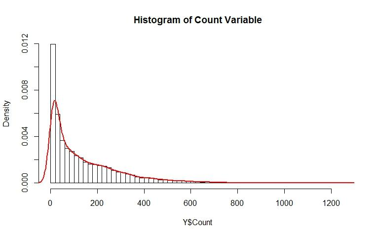

# Citation

[website](https://www.analyticsvidhya.com/blog/2018/07/introductory-guide-maximum-likelihood-estimation-case-study-r/)

# Introduction

Inspecting how well a model works is one of the most basic and yet most critical aspects of data science. You build a model that is giving you pretty impressive results, but what was the process behind it? As a data scientist, you need to understand and have an answer for this oft-asked question.

For example, let's say you built a model to predict the stock price of a company. You observed that the stock price increased rapidly over night. There could be several reasons behind it. Finding the likelihood of the most probable is what Maximum Likelihood Estimation is all about. This concept is used in economics, MRIs, satellite imaging, among many others.

# Why Should I use Maximum Likelihood Estimation (MLE)?

Let us say we want to predict the sale of tickets for an event. The data has the following histogram and density.

How would you handle such a variable? The variable is not normally distributed and is asymmetric and hence it violates the assumptions of linear regression. A popular way is to transform the variable with log, sqrt, reciprocal, etc. so that the transformed variable is normally distributed and can be modelled with linear regression.

Let's try these transformations and see how the results are:

