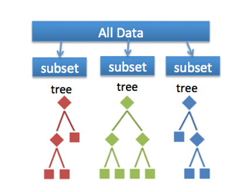
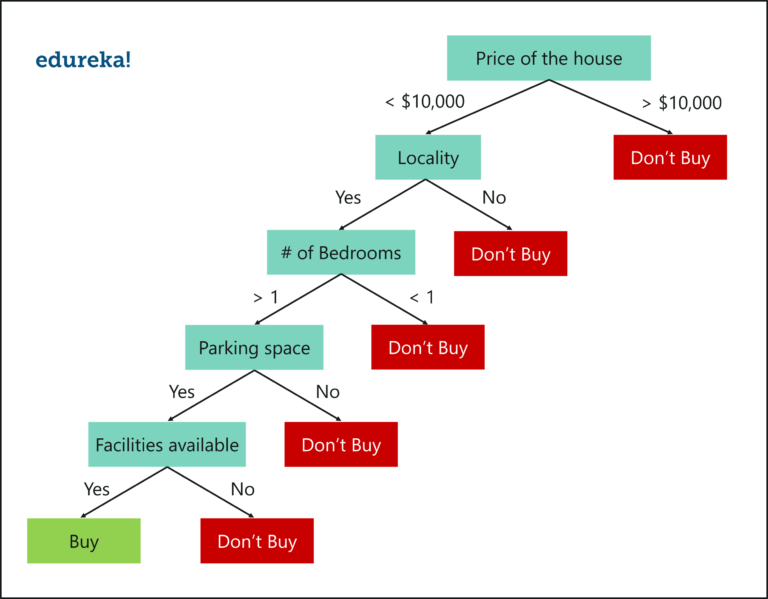
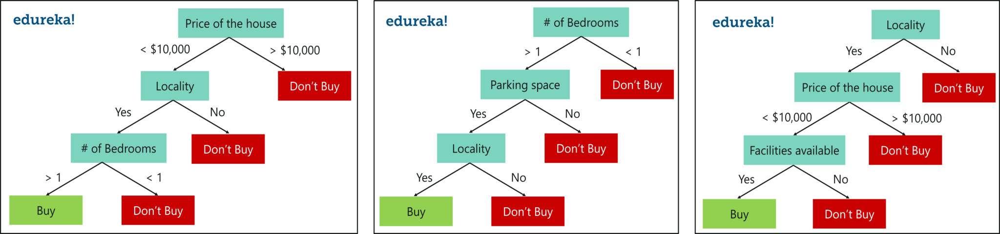
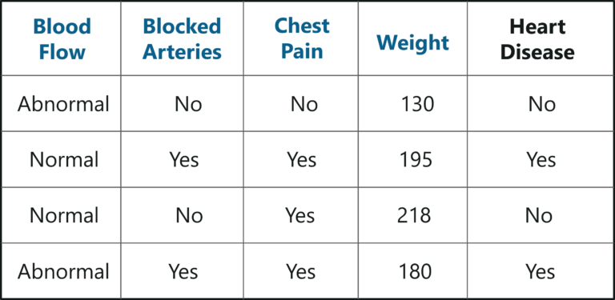
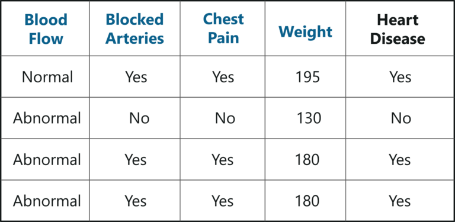
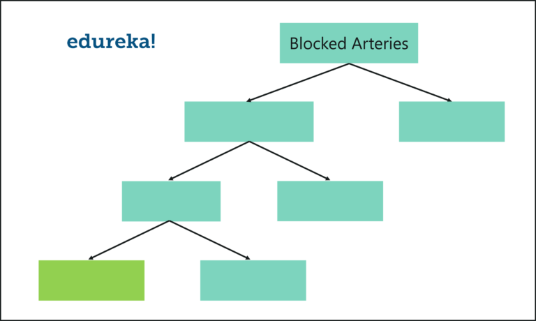
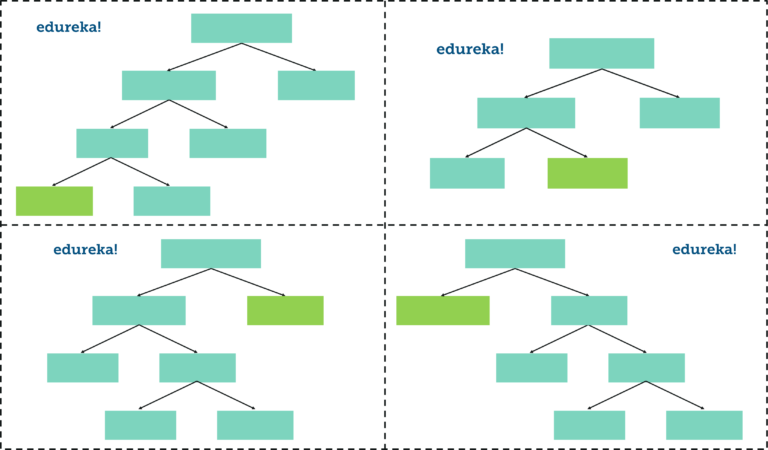
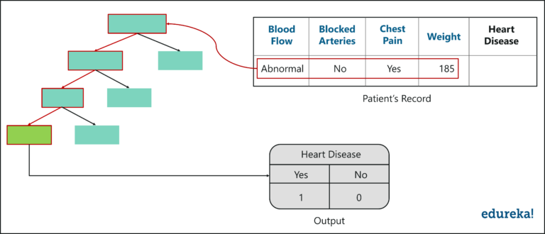
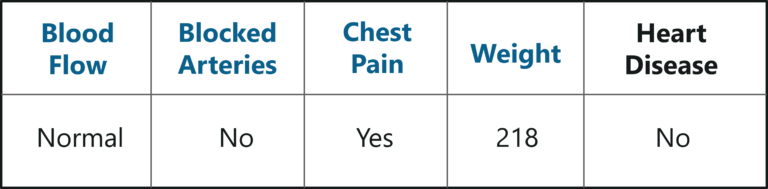

# Resource

# Introduction

With the demand of more complex computations, we cannot rely on simplistic algorithms. Instead, we must utilize algorithms with higher computational capabilities and one such algorithm is the Random Forest.

# What is Random Forest

Random Forest algorithm is a supervised classification and regression algorithm. As the name suggests, this algorithm creates a forest with several trees.

Generally, the more trees in the forest, the more robust the forest looks like. Similiarly in the Random Forest classifier, the higher the number of trees in the forest, the greater the accuracy of the results.

In simple words, Random Forest builds multiple Decision Trees (called a forest) and glues them together to get a more accurate and stable prediction. The forest it builds is a collection of Decision Trees, trained with the bagging method.

Before we discuss the Random Forest in depth, we need to understand how Decision Trees work.

# What is the difference between Random Forest and Decision Trees?

Let's say you are looking to buy a house, but you are unable to decide on which one to buy. So, you consult a few agents and they give you a list of parameters that you should consider before buying a house. This list includes:

* Price of the house
* Locality
* Number of bedrooms
* Parking spaces
* Available facilities

These parameters are known as *predictor variables*, which are used to find the response variable. Here’s a diagrammatic illustration of how you can represent the above problem statement using a decision tree.

An important point to note here is that **Decision Trees are built on the entire data set, by making use of all predictor variables**.

Now, let's see how Random Forest would solve the same problem.

As mentioned above, Random Forests is an ensemble of Decision Trees. The algorithm randomly selects a set of parameters and creates a decision tree for each set of chosen parameters. Take a look at the figure below...

Here, we've created 3 Decision Trees and each Decision Tree is using only 3 parameters from the entire dataset. Each Decision Tree predicts the outcome based on the respective predictor variables used in that tree and finally takes the average of the results from all Decision Trees in the Random Forest.

In simple words, after creating multiple Decision Trees using this method, each Tree selects or votes the class (in this case each Decision Tree will decide whether or not a house is bought), and the class receiving the most votes by a simple majority is termed the predicted class.

To conclude, Decision Trees are built on the entire dataset using all the predictor variables. In contrast, Random Forests are used to create multiple Decision Trees on small subsets of the predictor variables.

The difference between Random Forests and Decision Trees should be clear at this point.

# Why use Random Forest?

You might be wondering why use Random Forest when the same problem can be solved with a Decision Tree. Let me explain:

* Even though Decision trees are convenient and easily implemented, they lack accuracy. Decision trees work very effectively with the training data that was used to build them, but they’re not flexible when it comes to classifying the new sample. Which means that the accuracy during testing phase is very low.
* This happens due to a process called Over-fitting.
* This means that the disturbance in the training data is recorded and learned as concepts by the model. But the problem here is that these concepts do not apply to the testing data and negatively impact the model’s ability to classify the new data, hence reducing the accuracy on the testing data.

**Over-fitting occurs when a model studies the training data to such an extent that it negatively influences the performance of the model on new data.**

This is where Random Forest comes in. It is based on the idea of bagging (bootstrap aggregation), which is used to reduce the variation in the predictions by combining the result of multiple Decision trees on different samples of the data set.

# How does a Random Forest Work?

# Creating a Random Forest

## Step 1: Create a Bootstrapped Data Set

## Step 2: Creating Decision Trees

## Step 3: Go back to step 1 and repeat

## Step 4: Predicting the outcome of a new data point

## Step 5: Evaluate the Model

# Practical Implementation of Random Forest in R

